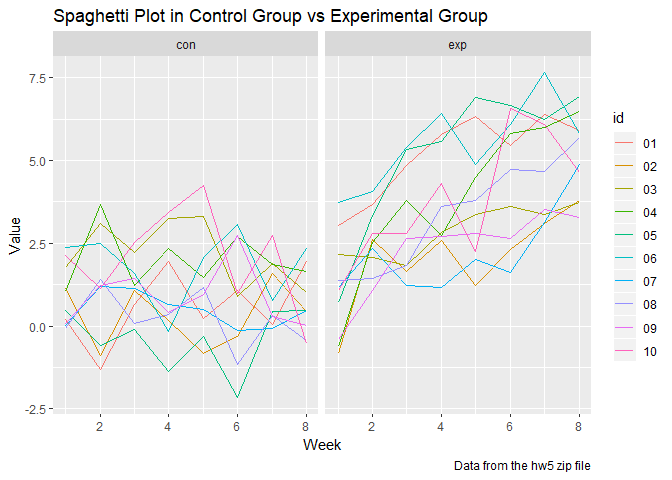

p8105\_hw5\_yz3297
================
Yue Zhao
2018年11月6日

Problem 1
=========

``` r
data_name= list.files(path = "./data") %>% 
  as.data.frame()
  colnames(data_name) ="file_name"
setwd("./data")

df1= map_df(as.character(data_name$file_name), read_csv)

#read in the csv files

df2= data_name %>% 
    mutate(id= substr(file_name,5,6)) %>% 
    mutate(arm= substr(file_name,1,3)) %>% 
    select(id,arm)

#extract id and arm

df3 = cbind(df2,df1) %>%
  gather(key=week,value=value,week_1:week_8) %>%
  mutate(week=substr(week,6,6))

#bind the datasets and make the dataset tidy

df3 %>% 
  ggplot(aes(x = as.numeric(week), y = value, color=id)) + 
   labs(
      title = "Spaghetti Plot in Control Group vs Experimental Group",
      x = "Week",
      y = "Value",
      caption = "Data from the hw5 zip file"
    ) +
  geom_line() +
  facet_grid(~arm)
```



``` r
#make a spaghetti plot  
```

In the experimental group, we can see a increasing trend as time goes on. In the control group, we see a flat pattern.

\`\`\`
