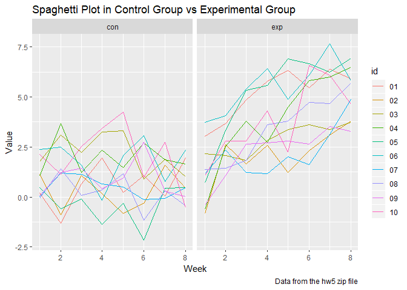
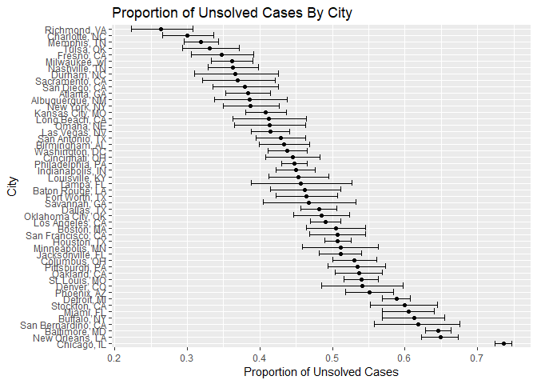

p8105\_hw5\_yz3297
================
Yue Zhao
2018年11月6日

Problem 1
=========

``` r
data_name= list.files(path = "./data") %>% 
  as.data.frame()
  colnames(data_name) ="file_name"
  
setwd("./data")

df1= map_df(as.character(data_name$file_name), read_csv)

#read in the csv files

df2= data_name %>% 
    mutate(id= substr(file_name,5,6)) %>% 
    mutate(arm= substr(file_name,1,3)) %>% 
    select(id,arm)

#extract id and arm

df3 = cbind(df2,df1) %>%
  gather(key=week,value=value,week_1:week_8) %>%
  mutate(week=substr(week,6,6))

#bind the datasets and make the dataset tidy
```

#### I created two datasets:df1 and df2. df1 is to load the content using `map_df` function. df2 is to load the name of the file. Then I binded the two datasets together and called it df3. To make it tidy, I turned df3 from wide to long form using `gather` function.

``` r
df3 %>% 
  ggplot(aes(x = as.numeric(week), y = value, color=id)) + 
   labs(
      title = "Spaghetti Plot in Control Group vs Experimental Group",
      x = "Week",
      y = "Value",
      caption = "Data from the hw5 zip file"
    ) +
  geom_line() +
  facet_grid(~arm)
```



``` r
#make a spaghetti plot  
```

#### Above is the plot of value against time by each participant. In the experimental group, we can see a increasing trend as time goes on. In the control group, we see a flat pattern.

Problem 2
=========

``` r
homicide_data= read_csv(file="./homicide-data.csv") %>%
   mutate(city_state=paste(city,state,sep=", ")) 

homicide_data
```

    ## # A tibble: 52,179 x 13
    ##    uid   reported_date victim_last victim_first victim_race victim_age
    ##    <chr>         <int> <chr>       <chr>        <chr>       <chr>     
    ##  1 Alb-~      20100504 GARCIA      JUAN         Hispanic    78        
    ##  2 Alb-~      20100216 MONTOYA     CAMERON      Hispanic    17        
    ##  3 Alb-~      20100601 SATTERFIELD VIVIANA      White       15        
    ##  4 Alb-~      20100101 MENDIOLA    CARLOS       Hispanic    32        
    ##  5 Alb-~      20100102 MULA        VIVIAN       White       72        
    ##  6 Alb-~      20100126 BOOK        GERALDINE    White       91        
    ##  7 Alb-~      20100127 MALDONADO   DAVID        Hispanic    52        
    ##  8 Alb-~      20100127 MALDONADO   CONNIE       Hispanic    52        
    ##  9 Alb-~      20100130 MARTIN-LEY~ GUSTAVO      White       56        
    ## 10 Alb-~      20100210 HERRERA     ISRAEL       Hispanic    43        
    ## # ... with 52,169 more rows, and 7 more variables: victim_sex <chr>,
    ## #   city <chr>, state <chr>, lat <dbl>, lon <dbl>, disposition <chr>,
    ## #   city_state <chr>

#### The dataset has 13 variables and 52179 observations. The main variables are id, date, victim first name, last name, race and age.

``` r
homicide_data %>% 
   group_by(city_state) %>% 
   count(city_state)
```

    ## # A tibble: 51 x 2
    ## # Groups:   city_state [51]
    ##    city_state          n
    ##    <chr>           <int>
    ##  1 Albuquerque, NM   378
    ##  2 Atlanta, GA       973
    ##  3 Baltimore, MD    2827
    ##  4 Baton Rouge, LA   424
    ##  5 Birmingham, AL    800
    ##  6 Boston, MA        614
    ##  7 Buffalo, NY       521
    ##  8 Charlotte, NC     687
    ##  9 Chicago, IL      5535
    ## 10 Cincinnati, OH    694
    ## # ... with 41 more rows

``` r
#Above is the total number of homicides in each city

homicide_data %>% 
   filter(disposition == "Closed without arrest" | disposition == "Open/No arrest") %>% 
   group_by(city_state) %>% 
   count(city_state)
```

    ## # A tibble: 50 x 2
    ## # Groups:   city_state [50]
    ##    city_state          n
    ##    <chr>           <int>
    ##  1 Albuquerque, NM   146
    ##  2 Atlanta, GA       373
    ##  3 Baltimore, MD    1825
    ##  4 Baton Rouge, LA   196
    ##  5 Birmingham, AL    347
    ##  6 Boston, MA        310
    ##  7 Buffalo, NY       319
    ##  8 Charlotte, NC     206
    ##  9 Chicago, IL      4073
    ## 10 Cincinnati, OH    309
    ## # ... with 40 more rows

``` r
#Above is the total number of unsolved homicides in each city
```

#### I printed out several observations of the total homicides and unsolved homicides in each city.

``` r
  n1= homicide_data %>% 
    filter(disposition == "Closed without arrest" | disposition == "Open/No arrest") %>% 
    filter(city_state=="Baltimore, MD") %>% 
    count(city_state)
  
  n2= homicide_data %>% 
    filter(city_state=="Baltimore, MD") %>% 
    count(city_state)
  
  prop.test(n1$n, n2$n) %>% 
  broom::tidy() %>% 
  select(estimate, conf.low, conf.high) %>% 
  knitr::kable(digits=3)
```

|  estimate|  conf.low|  conf.high|
|---------:|---------:|----------:|
|     0.646|     0.628|      0.663|

#### The point estimate and confidence interval of Baltimore, MD is given above. I calculated the unsolved and total number for Baltimore, MD and then use the function `prop.test`.

``` r
total_crime = homicide_data %>%
    group_by(city_state) %>%
    summarise(total = n()) 

# total case in a city

unsolved = homicide_data %>%
  filter(disposition %in% c ("Closed without arrest", "Open/No arrest")) %>%
  group_by(city_state)  %>%
  summarise(unsolved = n())
# unsolved case in a city 

overall_crime=left_join(unsolved,total_crime,id=city_state)
```

    ## Joining, by = "city_state"

#### I combined the unsolved data and the total crime data into a single dataset called overall\_crime.

``` r
prop_2= function(x) {
  broom::tidy(prop.test(x$unsolved, x$total)) %>%
    select(estimate, conf.low, conf.high)
}

final_data = nest(overall_crime, unsolved:total) %>%
  mutate(unsolved_prop = map(data, prop_2)) %>% 
  unnest()
```

#### I defined a function prop\_2 and made the `prop.test` result tidy by using `broom::tidy`. I also nested the unsolved and total number into a list called "data". Then I mapped my data to the final\_data and then unnested it. This dataset final\_data contains the name of the city, unsolved, total homicides, point estimate and the confidence interval lower and upper bounds.

``` r
final_data %>% 
  mutate(city_state = fct_reorder(city_state,estimate,.desc=TRUE)) %>%
  ggplot(aes(x = city_state, y = estimate)) +
        geom_point() +
        labs(title = "Proportion of Unsolved Cases By City",
             x = "City",
             y = "Proportion of Unsolved Cases",
             Caption = "Point Estimate and 95% confidence interval") +
        geom_errorbar(aes(ymin = conf.low, ymax = conf.high)) +
        coord_flip()
```



#### This is the graph showing the estimates and CIs for each city. I switched coordinates between x and y since this looks more tidy than the other way around.
